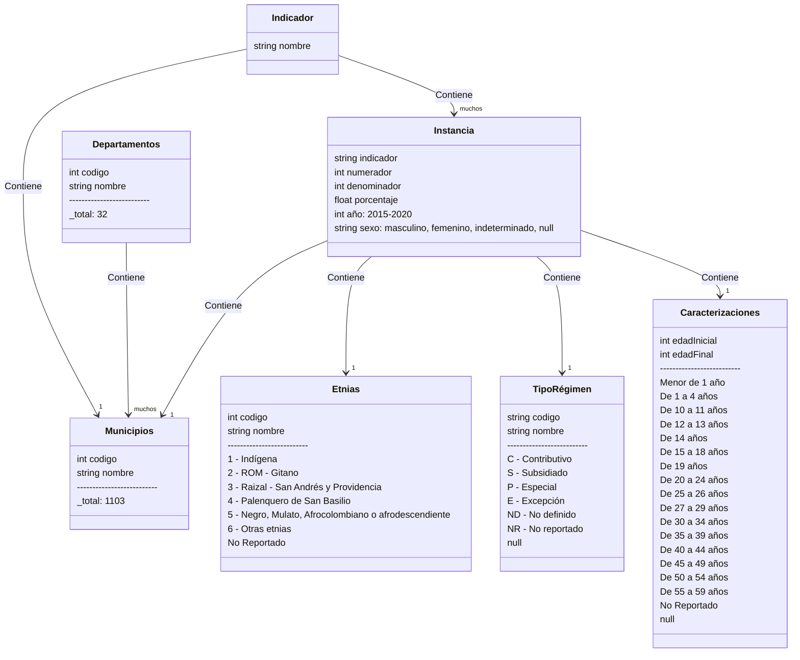

# API para proyecto de salud maternoinfantil

## Arreglos manuales

### mortalidad neonatal temprana

- Borramos las siguientes filas, ya que tiene fin e inicio de tablas (Total General y de nuevo los encabezados de fila 1). Seguramente no se borraron al aplanar:
  - 25992 a 25994
  - 51303 a 51306
  - 76868 a 76871
  - 102783 a 102786
  - 128868 a 128871

## Modelado



## PGAdmin

Arreglar permiso de volumen:

```bash
sudo chown -R 5050:5050 ./pgadmin
```
